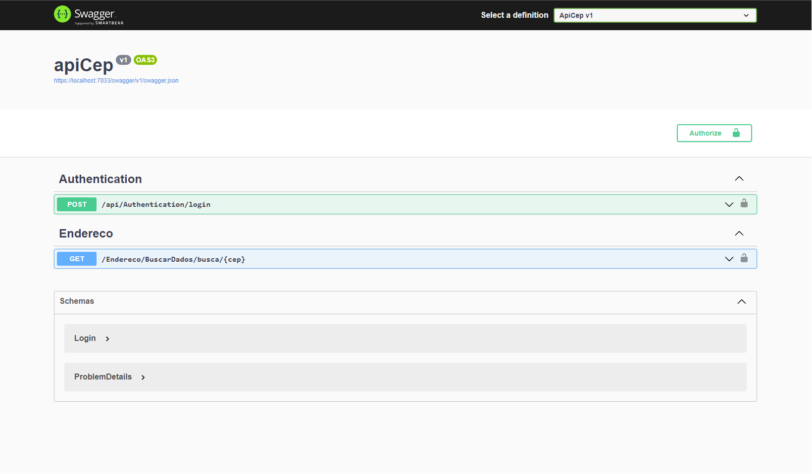

# Buscar CEP Via API - ViaCep  🔍📌

Aplicação feita em C#, para consultar CEP de endereçamento do Brasil. Para Consultar CEP basta você fazer uma **requisição http** para a **API do ViaCep** e então obter o retorno com informações como **CEP**, nome da **Cidade**, **Código do Município**, **UF** etc.

-Memory cache. 
-Autenticação via token. 
-Tratamento de erros. 

# Vídeo 📸

    
